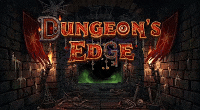

🇺🇸 English | 🇧🇷 [Português](README_PT.md)

  

# 🎮 Dungeons Edge

**Dungeons Edge** is a 2D web game built with pure JavaScript. It started as a university assignment intended to be a collection of four small minigames. Due to tight deadlines and heavy workload, development became my sole responsibility — and the project evolved into something far more ambitious than the original assignment.

## ⚠️ Important note about AI usage

The use of **artificial intelligence (AI)** was essential from the early stages. AI tools and models were used to:
- prototype and generate complex gameplay logic;
- automate routines and testing;
- help create systems that form the backbone of the game's functionality.
-create game assets, such as visual elements, graphical resources, and other components used during development.

Due to the way these solutions were integrated, continuing development without AI support becomes impractical: the generated logic and fine-tuned adjustments are too complex to be manually rewritten within a reasonable time frame. In addition, the constant analysis and ongoing adjustments to both code and assets created by the AI, currently represent one of the main challenges in development.

It is also important to note that many of the assets used could theoretically be produced without AI. However, this is not viable for this project, as I do not have the financial resources to hire artists or purchase assets, nor do I possess all the technical skills required to create them manually. As a result, AI makes it possible to create resources that otherwise could not be included in the game.

## 🚧 Current Status
- Core mechanics implemented (movement, collisions, basic interactions).
- Partially functional gameplay.
- Pixel-art graphics and image-based assets.
- Actively under development and ready for expansion.

## 💡 Technologies Used
- HTML5  
- Pure JavaScript (Vanilla JS)  
- Canvas API for 2D rendering

## 🗺️Story

Centuries ago the Kingdom of Eldoria lived in peace, guarded by walls and ancient magic. That peace was shattered when an ancient shadow was freed. One dark night the castle was breached and Princess Amélia was kidnapped, taken to a mysterious dungeon below the earth — a living labyrinth full of traps and terrible creatures.

Legend speaks of heroes who can brave the dungeon and bring light back to the kingdom. Will you guide them? Make the right choices and rescue Amélia; fail and darkness will consume everything.

